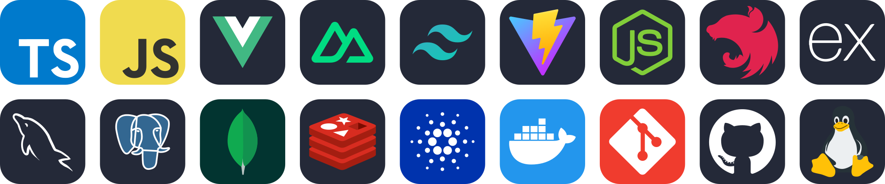

  <!-- Dynamic Waving Animated Gradient Banner -->
  

  <!-- Animated Dynamic Typing SVG -->
  

  

  <!-- Metric Badges -->
  

    
    
  

---

### About Me

- Fullstack Software Engineer at **[VTechcom](https://vtechcom.org)** based in Vietnam.
- Focused on **Vue 3**, **Nuxt 3**, and **NestJS** for building scalable web systems.
- Exploring **Cardano blockchain** & **Hydra** layer-2 scalability.
- Writing clean, typed code with **TypeScript** across the full stack.

---

<!-- ### Tech Stack & Arsenal

  

  -->

#### Frontend & UI Frameworks

#### Backend, APIs & Architecture

#### Databases & Caching

#### Web3 & Blockchain

#### DevOps & Tools

